# Linked List Problems

## 1. Print Linked List  
**Question:** Print all elements of a linked list.  
**Link:** [Print Linked List Elements](https://www.geeksforgeeks.org/problems/print-linked-list-elements/0)  
**Solution:**  
```cpp
void printList(Node *head) {
    Node*curr=head;
    while(curr!=NULL){
        cout<<curr->data<<" ";
        curr=curr->next;
    }
}
```
**Screenshot:**  
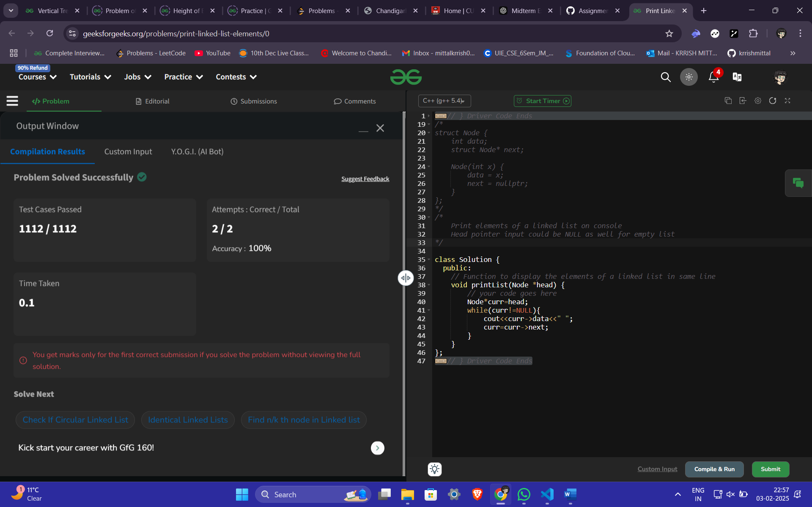  

---

## 2. Remove Duplicates from a Sorted List  
**Question:** Remove duplicates from a sorted linked list.  
**Link:** [Remove Duplicates from Sorted List](https://leetcode.com/problems/remove-duplicates-from-sorted-list)  
**Solution:**  
```cpp
ListNode* deleteDuplicates(ListNode* head) {
    if(head==NULL){
        return head;
    }
    ListNode*curr=head;
    while(curr->next!=NULL){
        if (curr->val==curr->next->val){
            ListNode* temp=curr->next;
            curr->next=curr->next->next;
            delete temp;
        }
        else{
            curr=curr->next;
        }
    }
    return head;    
}
```
**Screenshot:**  
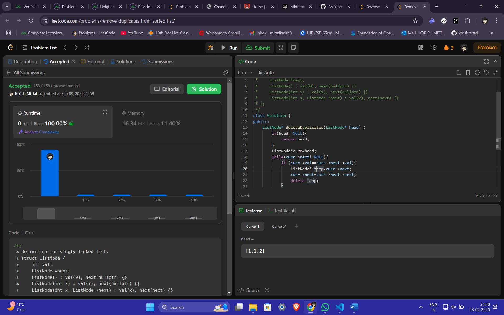  

---

## 3. Reverse a Linked List  
**Question:** Reverse a linked list.  
**Link:** [Reverse Linked List](https://leetcode.com/problems/reverse-linked-list/)  
**Solution:**  
```cpp
ListNode* reverseList(ListNode* head) {
    if (!head) return nullptr;
    vector<int> stack;
    ListNode* temp = head;
    // Push all values to stack
    while (temp) {
        stack.push_back(temp->val);
        temp = temp->next;
    }
    // Create a new linked list
    ListNode* newHead = new ListNode(stack.back());
    ListNode* curr = newHead;
    for (int i = stack.size() - 2; i >= 0; --i) {
        curr->next = new ListNode(stack[i]);
        curr = curr->next;
    }

    return newHead;
}
```
**Screenshot:**  
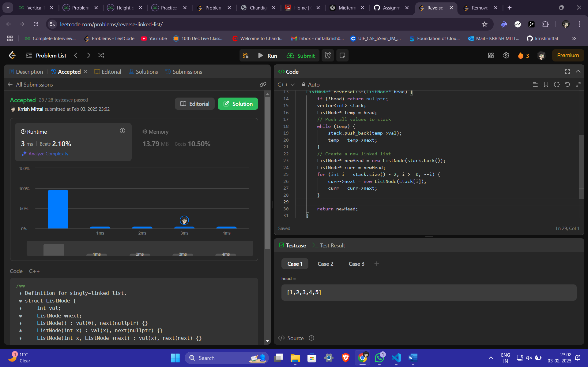 

---

## 4. Delete the Middle Node of a List  
**Question:** Delete the middle node of a linked list.  
**Link:** [Delete the Middle Node of a Linked List](https://leetcode.com/problems/delete-the-middle-node-of-a-linked-list/)  
**Solution:**  
```cpp
ListNode* deleteMiddle(ListNode* head) {
    int middle = 0;
    ListNode *temp = head;

    if (head->next == nullptr) {
        return nullptr;
    }
    while (temp != nullptr) {
        temp = temp->next;
        middle++;
    }
    middle = middle / 2 - 1;
    ListNode *current = head;
    while (middle != 0) {
        current = current->next;
        middle--;
    }

    ListNode *tempNode = current->next;
    current->next = tempNode->next;
    delete tempNode;

    return head;
}
```
**Screenshot:**  
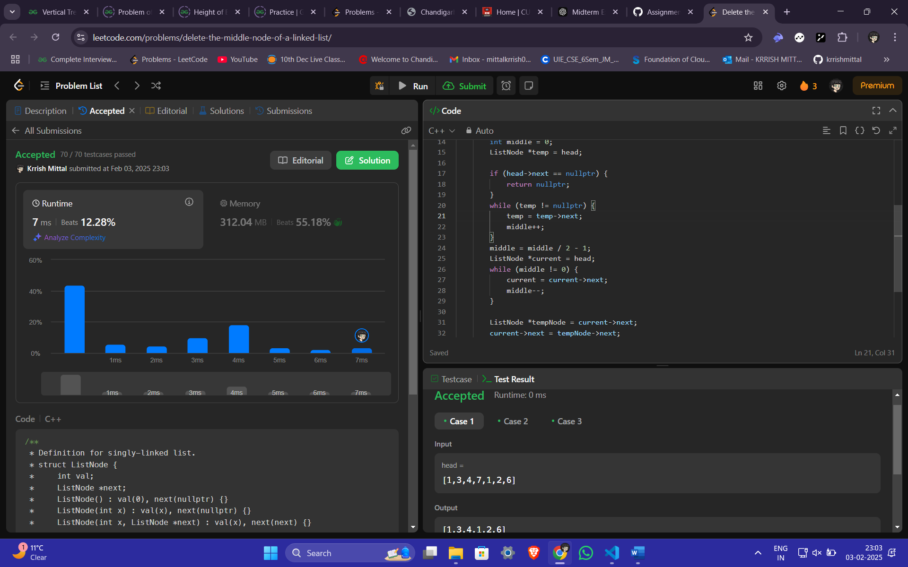  

---

## 5. Merge Two Sorted Linked Lists  
**Question:** Merge two sorted linked lists into one sorted list.  
**Link:** [Merge Two Sorted Lists](https://leetcode.com/problems/merge-two-sorted-lists/)  
**Solution:**  
```cpp
ListNode* mergeTwoLists(ListNode* l1, ListNode* l2) {
    if(list1==NULL){
        return list2;
    }
    if(list2==NULL){
        return list1;
    }
    if(list1->val<=list2->val){
        list1->next=mergeTwoLists(list1->next,list2);
        return list1;
    }
    else{
        list2->next=mergeTwoLists(list1,list2->next);
        return list2;
    }
}
```
**Screenshot:**  
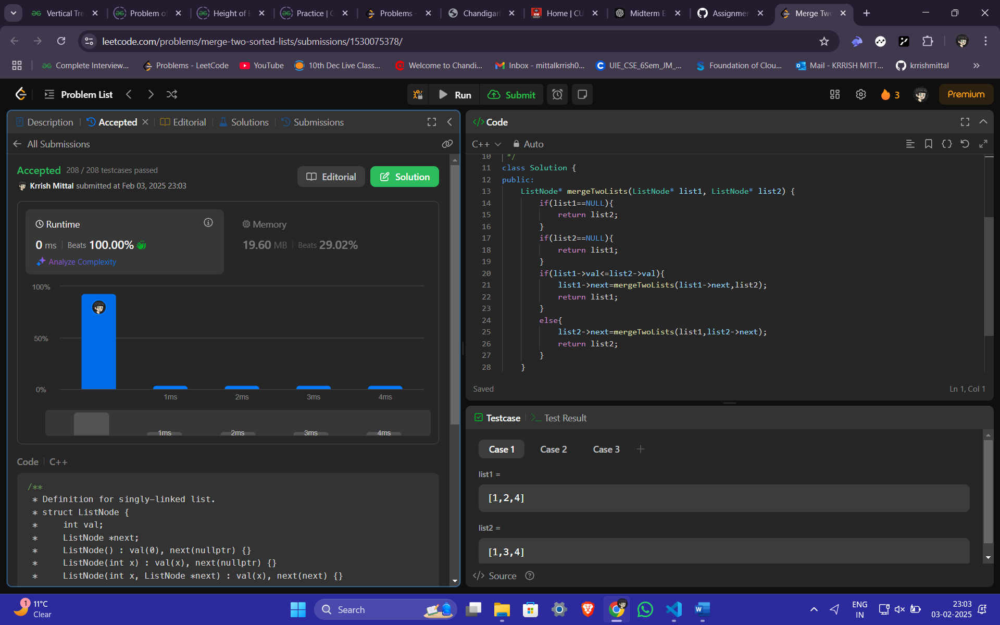  

---

## 6. Remove Duplicates from Sorted Lists II  
**Question:** Remove all duplicates from a sorted linked list, including the duplicates themselves.  
**Link:** [Remove Duplicates from Sorted List II](https://leetcode.com/problems/remove-duplicates-from-sorted-list-ii/)  
**Solution:**  
```cpp
ListNode* deleteDuplicates(ListNode* head) {
    ListNode dummy(0, head);
    ListNode* prev = &dummy;
    while (head) {
        if (head->next && head->val == head->next->val) {
            while (head->next && head->val == head->next->val) 
                head = head->next;
            prev->next = head->next;
        } else {
            prev = prev->next;
        }
        head = head->next;
    }
    return dummy.next;
}
```
**Screenshot:**  
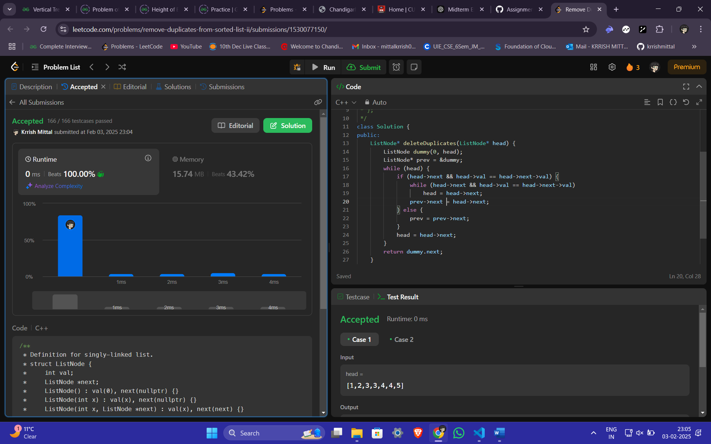  

---

## 7. Detect Cycle in a Linked List  
**Question:** Detect if a linked list has a cycle.  
**Link:** [Linked List Cycle](https://leetcode.com/problems/linked-list-cycle/)  
**Solution:**  
```cpp
bool hasCycle(ListNode* head) {
    ListNode *slow=head;
    ListNode*fast=head;
    while(fast!=NULL &&fast->next!=NULL){
        slow=slow->next;
        fast=fast->next->next;
        if(fast==slow){
            return true;
        }
    }
    return false;
}
```
**Screenshot:**  
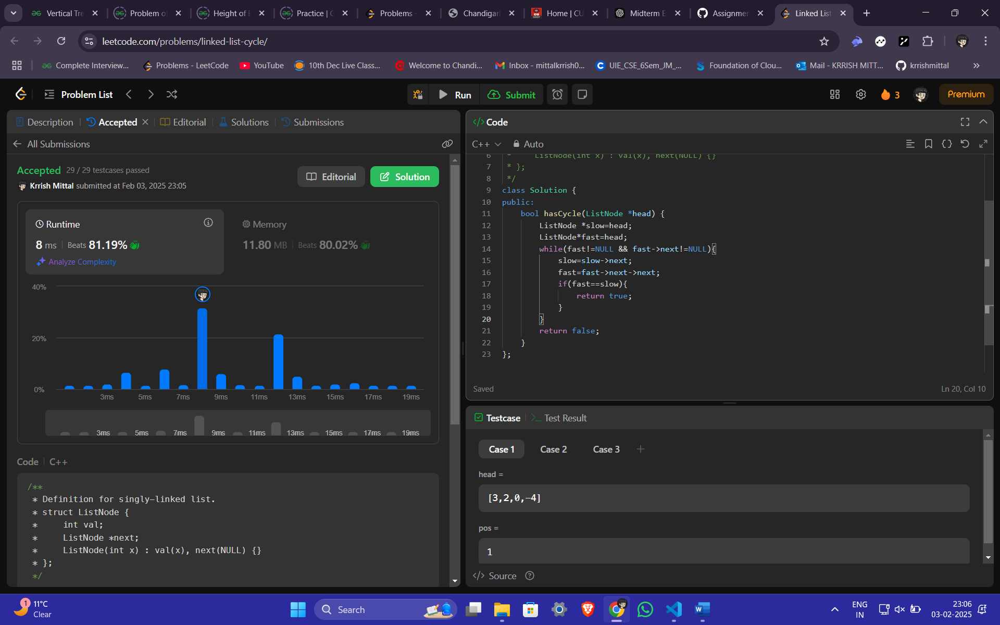 

---

## 8. Reverse Linked List II  
**Question:** Reverse a portion of a linked list between two indices.  
**Link:** [Reverse Linked List II](https://leetcode.com/problems/reverse-linked-list-ii/)  
**Solution:**  
```cpp
ListNode* reverseBetween(ListNode* head, int left, int right) {
    ListNode dummy(0, head);
    ListNode* prev = &dummy;
    for (int i = 0; i < left - 1; ++i) prev = prev->next;
    ListNode* curr = prev->next;
    for (int i = 0; i < right - left; ++i) {
        ListNode* temp = curr->next;
        curr->next = temp->next;
        temp->next = prev->next;
        prev->next = temp;
    }
    return dummy.next;
}
```
**Screenshot:**  
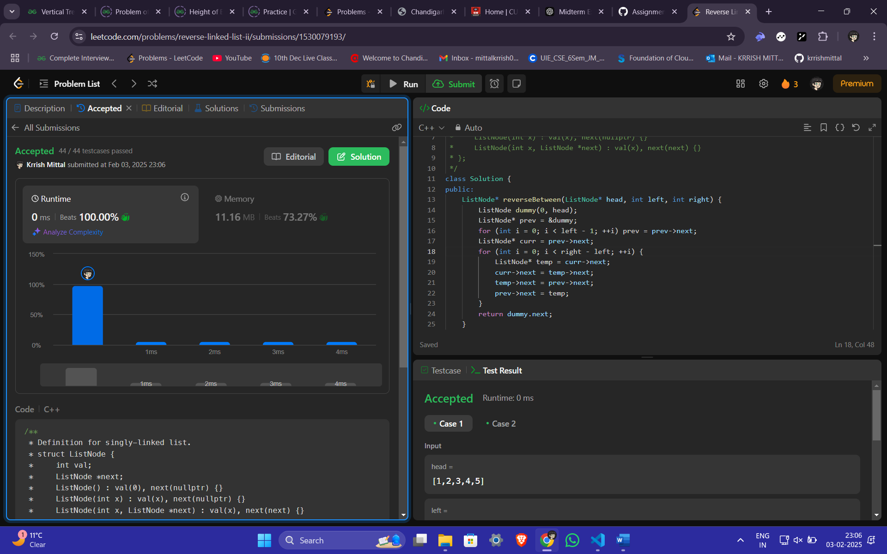

---

## 9. Rotate Linked List  
**Question:** Rotate a linked list to the right by k places.  
**Link:** [Rotate List](https://leetcode.com/problems/rotate-list/)  
**Solution:**  
```cpp
ListNode* rotateRight(ListNode* head, int k) {
    if(head==NULL || head->next==NULL){
        return head;
    }
    int length=1;
    ListNode* temp=head;
    while(temp->next!=NULL){
        temp=temp->next;
        length++;
    }
    temp->next=head;
    k=k%length;
    for(int i=0;i<length-k;i++){
        temp=temp->next;
    }
    head=temp->next;
    temp->next=NULL;
    return head;
}
```
**Screenshot:**  
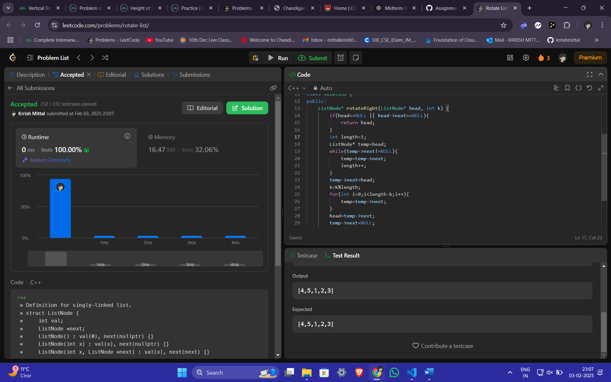 

---

## 10. Merge k Sorted Lists  
**Question:** Merge k sorted linked lists into one sorted list.  
**Link:** [Merge k Sorted Lists](https://leetcode.com/problems/merge-k-sorted-lists/)  
**Solution:**  
```cpp
ListNode* mergeKLists(vector<ListNode*>& lists) {
    int n = lists.size();
    vector<int> l;
    for(int i=0;i<n;i++){
            ListNode* itr = lists[i];
        while(itr != NULL){
            l.push_back(itr->val);
                itr = itr->next;
        }
    }
    if(n==0 || l.size()==0){
        return NULL;
    }
    sort(l.begin(),l.end());
    ListNode* head = new ListNode(l[0]);
    ListNode* it = head;
    for(int i=1;i<l.size();i++){
        ListNode* a = new ListNode(l[i]);
        it->next = a;
        it = it->next;
    }
    it->next = NULL;
    return head;
}
```
**Screenshot:**  
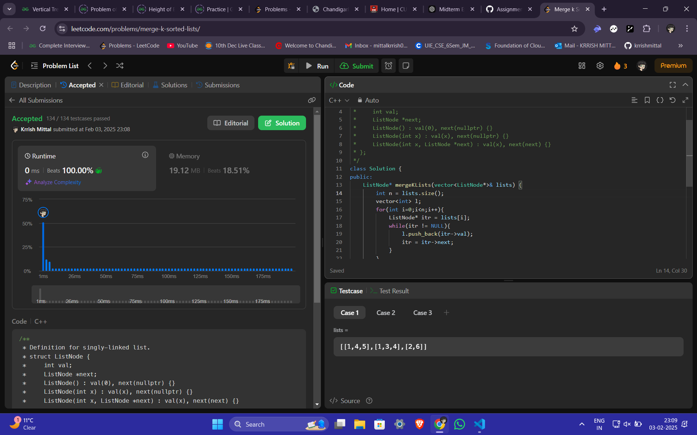 

---

## 11. Sort a Linked List  
**Question:** Sort a linked list in ascending order.  
**Link:** [Sort List](https://leetcode.com/problems/sort-list/)  
**Solution:**  
```cpp
ListNode* merge(ListNode* l1, ListNode* l2) {
    ListNode dummy(0);
    ListNode* tail = &dummy;
    while (l1 && l2) {
        if (l1->val < l2->val) {
            tail->next = l1;
            l1 = l1->next;
        } else {
            tail->next = l2;
            l2 = l2->next;
        }
        tail = tail->next;
    }
    tail->next = l1 ? l1 : l2;
    return dummy.next;
}

ListNode* sortList(ListNode* head) {
    if (!head || !head->next) return head;
    ListNode *slow = head, *fast = head, *prev = nullptr;
    while (fast && fast->next) {
        prev = slow;
        slow = slow->next;
        fast = fast->next->next;
    }
    prev->next = nullptr;
    return merge(sortList(head), sortList(slow));
}
```
**Screenshot:**  
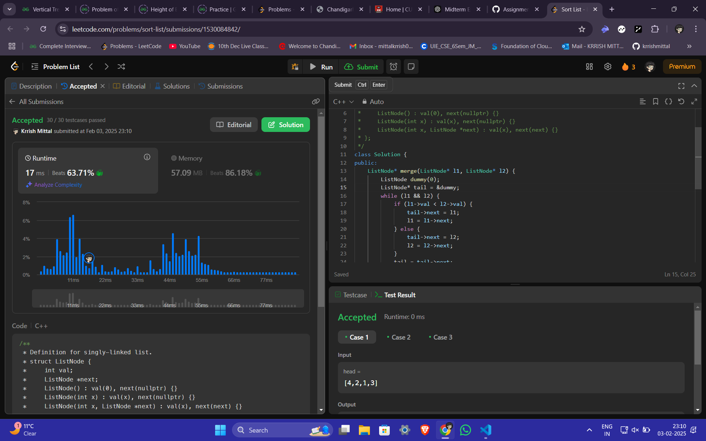 
```
```
