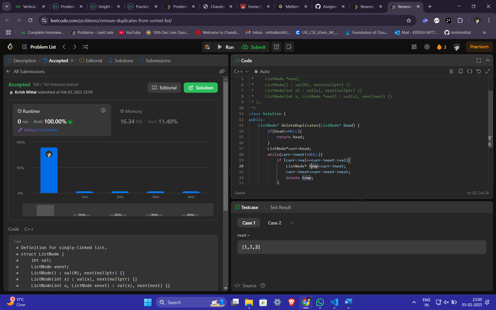

# Krrish Mittal - C++ Solutions to Assignment 1

UID: 22BCS13506  
LeetCode Profile Link: [Krrish Mittal](https://leetcode.com/u/mittalkrrnw1x/)

# Arrays Problems

## 1. Remove duplicates from a sorted array  
**Question:** Given an integer array nums sorted in non-decreasing order, remove the duplicates in-place such that each unique element appears only once. The relative order of the elements should be kept the same. Then return the number of unique elements in nums..  
**Link:** [Remove duplicates from a sorted array](https://leetcode.com/problems/remove-duplicates-from-sorted-array/description/)  
**Solution:**  
```cpp
int removeDuplicates(vector<int>& nums){
    int n=nums.size();
    if(n==0){
        return 0;
    }
    int sz=1;
    for(int i=0;i<n;i++){
        if(nums[i]!=nums[sz-1]){
            sz++;
            nums[sz-1]=nums[i];
        }
    }
    return sz;
}
```
**Screenshot:**  


---

## 2. Implementing insertion sort  
**Question:** The task is to complete the insertsort() function which is used to implement Insertion Sort..  
**Link:** [Insertion Sort](https://www.geeksforgeeks.org/problems/insertion-sort/1)  
**Solution:**  
```cpp
void insertionSort(vector<int>& arr) {
        // code here
    for(int i=1;i<arr.size();i++){
        int key=arr[i];
        int j=i-1;
        while(j>=0 && arr[j]>key){
            arr[j+1]=arr[j];
            j--;
        }
        arr[j+1]=key;
    }
}
```
**Screenshot:**  
 

---

## 3. Contains duplicate  
**Question:** Given an integer array nums, return true if any value appears at least twice in the array, and return false if every element is distinct.

**Link:** [Contains Duplicate](https://leetcode.com/problems/contains-duplicate/description/)  
**Solution:**  
```cpp
bool containsDuplicate(vector<int>& nums) {
    sort(nums.begin(),nums.end());
    for(int i=1;i<nums.size();i++){
        if(nums[i]==nums[i-1]){
            return true;
        }
    }
    return false;
}
```
**Screenshot:**  


---

## 4. Two Sum
**Question:** Given an array of integers nums and an integer target, return indices of the two numbers such that they add up to target. 

**Link:** [Two Sum](https://leetcode.com/problems/two-sum/description/)  
**Solution:**  
```cpp
vector<int> twoSum(vector<int>& arr, int target) {
    int n=arr.size();
    vector<int>ans;
    unordered_map<int,int>mp;
    for(int i=0;i<n;i++){
        int sum=target-arr[i];
        if(mp.find(sum)!=mp.end()){
            ans.push_back(mp[sum]);
            ans.push_back(i);
        }
        mp[arr[i]]=i;
    }
    return ans;
}
```
**Screenshot:**  
  

---

## 5. Jump Game
**Question:** You are given an integer array nums. You are initially positioned at the array's first index, and each element in the array represents your maximum jump length at that position.  
**Link:** [Jump Game](https://leetcode.com/problems/jump-game/description/)  
**Solution:**  
```cpp
bool canJump(vector<int>& nums) {
    int n=nums.size();
    int maxreach=0;
    for(int i=0;i<n;i++){
        if(i>maxreach){
            return false;
        }
        maxreach=max(maxreach,nums[i]+i);
    }
    return true;
}
```
**Screenshot:**  


---

## 6. Majority Element  
**Question:** Given an array nums of size n, return the majority element.

The majority element is the element that appears more than ⌊n / 2⌋ times. You may assume that the majority element always exists in the array.

**Link:** [ Majority Element](https://leetcode.com/problems/majority-element/description/)  
**Solution:**  
```cpp
int majorityElement(vector<int>& nums) {
    unordered_map<int,int>mp;
    int count=nums.size()/2;
    for (int num:nums) {
        mp[num]++;
        if (mp[num]>count) {
            return num;
        }
    }
    return -1;
}
```
**Screenshot:**  


---

## 7. Valid Palindrome
**Question:** A phrase is a palindrome if, after converting all uppercase letters into lowercase letters and removing all non-alphanumeric characters, it reads the same forward and backward. Alphanumeric characters include letters and numbers.  
**Link:** [Valid Palindrome](https://leetcode.com/problems/valid-palindrome/description/)  
**Solution:**  
```cpp
bool isPalindrome(string s) {
    string res;
    for(int i = 0;i<s.length();i++){
        if(((int)s[i] > 64 && (int)s[i] < 91) || ((int)s[i] > 96 && (int)s[i] < 123) || ((int)s[i] > 47 && (int)s[i] < 58)){
            res+=tolower(s[i]);
        }
    }
    string check=res;
    reverse(res.begin(),res.end());
    cout<<res;
    if(res==check)
        return true;
    return false; 
}
```
**Screenshot:**  


---

## 8. Jump Game 2 
**Question:** You are given a 0-indexed array of integers nums of length n. You are initially positioned at nums[0].

Each element nums[i] represents the maximum length of a forward jump from index i. In other words, if you are at nums[i], you can jump to any nums[i + j] where:  
**Link:** [Jump Game II](https://leetcode.com/problems/jump-game-ii/description/)  
**Solution:**  
```cpp
int jump(vector<int>& nums) {
    int near = 0, far = 0,jumps = 0;
    while (far < nums.size() - 1) {
        int farthest = 0;
        for (int i = near; i <= far; i++) {
            farthest = max(farthest, i + nums[i]);
        }
        near = far + 1;
        far = farthest;
        jumps++;
    }
    return jumps;        
}
```
**Screenshot:**  


---

## 9. 3Sum 
**Question:** Given an integer array nums, return all the triplets [nums[i], nums[j], nums[k]] such that i != j, i != k, and j != k, and nums[i] + nums[j] + nums[k] == 0.  
**Link:** [3Sum](https://leetcode.com/problems/3sum/description/)  
**Solution:**  
```cpp
vector<vector<int>> threeSum(vector<int>& nums) {
    vector<vector<int>> res;
    sort(nums.begin(), nums.end());
    for (int i = 0; i < nums.size(); i++) {
        if (i > 0 && nums[i] == nums[i-1]) {
            continue;
        }
        int j = i + 1;
        int k = nums.size() - 1;
        while (j < k) {
            int total = nums[i] + nums[j] + nums[k];
            if (total > 0) {
                k--;
            } else if (total < 0) {
                j++;
            } else {
                res.push_back({nums[i], nums[j], nums[k]});
                j++;
                while (nums[j] == nums[j-1] && j < k) {
                    j++;
                }
            }
        }
    }
    return res;       
}
```
**Screenshot:**  


---

## 10. Set Matrix Zeroes  
**Question:** Given an m x n integer matrix matrix, if an element is 0, set its entire row and column to 0's.  
**Link:** [ Set Matrix Zeroes](https://leetcode.com/problems/set-matrix-zeroes/description/)  
**Solution:**  
```cpp
void setZeroes(vector<vector<int>>& matrix) {
        int m=matrix.size();
        int n=matrix[0].size();
        vector<int>row(m,0);
        vector<int>col(n,0);
        for(int i=0;i<m;i++){
            for(int j=0;j<n;j++){
                if(matrix[i][j]==0){
                    row[i]=1;
                    col[j]=1;
                }
            }
        }
        for(int i=0;i<m;i++){
            for(int j=0;j<n;j++){
                if(row[i]==1 || col[j]==1){
                    matrix[i][j]=0;
                }
            }
        }
    }
```
**Screenshot:**  
 

---

## 11. Longest substring without repeating characters 
**Question:** Given a string s, find the length of the longest 
substring
 without repeating characters.  
**Link:** [Longest substring without repeating characters ](https://leetcode.com/problems/longest-substring-without-repeating-characters/description/)  
**Solution:**  
```cpp
int lengthOfLongestSubstring(string s) {
    int left = 0;
    int maxLength = 0;
    unordered_set<char> charSet;
    for (int right = 0; right < s.length(); right++) {
        while (charSet.find(s[right]) != charSet.end()) {
            charSet.erase(s[left]);
            left++;
        }
        charSet.insert(s[right]);
        maxLength = max(maxLength, right - left + 1);
    }
    return maxLength; 
}
```
**Screenshot:**  


---

## 12. Find the Duplicate Number 
**Question:** Sort a linked list in ascending order.  
**Link:** [Find the Duplicate Number](https://leetcode.com/problems/find-the-duplicate-number/description/)  
**Solution:**  
```cpp
int findDuplicate(vector<int>& nums) {
    unordered_map<int,int>mp;
    for(int i=0;i<nums.size();i++){
        if(mp[nums[i]]==1){
            return nums[i];
        }
        else{
            mp[nums[i]]++;
        }
    }
    return -1;
}
```
**Screenshot:**  
 

# Linked List Problems

## 1. Print Linked List  
**Question:** Print all elements of a linked list.  
**Link:** [Print Linked List Elements](https://www.geeksforgeeks.org/problems/print-linked-list-elements/0)  
**Solution:**  
```cpp
void printList(Node *head) {
    Node*curr=head;
    while(curr!=NULL){
        cout<<curr->data<<" ";
        curr=curr->next;
    }
}
```
**Screenshot:**  
  

---

## 2. Remove Duplicates from a Sorted List  
**Question:** Remove duplicates from a sorted linked list.  
**Link:** [Remove Duplicates from Sorted List](https://leetcode.com/problems/remove-duplicates-from-sorted-list)  
**Solution:**  
```cpp
ListNode* deleteDuplicates(ListNode* head) {
    if(head==NULL){
        return head;
    }
    ListNode*curr=head;
    while(curr->next!=NULL){
        if (curr->val==curr->next->val){
            ListNode* temp=curr->next;
            curr->next=curr->next->next;
            delete temp;
        }
        else{
            curr=curr->next;
        }
    }
    return head;    
}
```
**Screenshot:**  
  

---

## 3. Reverse a Linked List  
**Question:** Reverse a linked list.  
**Link:** [Reverse Linked List](https://leetcode.com/problems/reverse-linked-list/)  
**Solution:**  
```cpp
ListNode* reverseList(ListNode* head) {
    if (!head) return nullptr;
    vector<int> stack;
    ListNode* temp = head;
    // Push all values to stack
    while (temp) {
        stack.push_back(temp->val);
        temp = temp->next;
    }
    // Create a new linked list
    ListNode* newHead = new ListNode(stack.back());
    ListNode* curr = newHead;
    for (int i = stack.size() - 2; i >= 0; --i) {
        curr->next = new ListNode(stack[i]);
        curr = curr->next;
    }

    return newHead;
}
```
**Screenshot:**  
 

---

## 4. Delete the Middle Node of a List  
**Question:** Delete the middle node of a linked list.  
**Link:** [Delete the Middle Node of a Linked List](https://leetcode.com/problems/delete-the-middle-node-of-a-linked-list/)  
**Solution:**  
```cpp
ListNode* deleteMiddle(ListNode* head) {
    int middle = 0;
    ListNode *temp = head;

    if (head->next == nullptr) {
        return nullptr;
    }
    while (temp != nullptr) {
        temp = temp->next;
        middle++;
    }
    middle = middle / 2 - 1;
    ListNode *current = head;
    while (middle != 0) {
        current = current->next;
        middle--;
    }

    ListNode *tempNode = current->next;
    current->next = tempNode->next;
    delete tempNode;

    return head;
}
```
**Screenshot:**  
  

---

## 5. Merge Two Sorted Linked Lists  
**Question:** Merge two sorted linked lists into one sorted list.  
**Link:** [Merge Two Sorted Lists](https://leetcode.com/problems/merge-two-sorted-lists/)  
**Solution:**  
```cpp
ListNode* mergeTwoLists(ListNode* l1, ListNode* l2) {
    if(list1==NULL){
        return list2;
    }
    if(list2==NULL){
        return list1;
    }
    if(list1->val<=list2->val){
        list1->next=mergeTwoLists(list1->next,list2);
        return list1;
    }
    else{
        list2->next=mergeTwoLists(list1,list2->next);
        return list2;
    }
}
```
**Screenshot:**  
  

---

## 6. Remove Duplicates from Sorted Lists II  
**Question:** Remove all duplicates from a sorted linked list, including the duplicates themselves.  
**Link:** [Remove Duplicates from Sorted List II](https://leetcode.com/problems/remove-duplicates-from-sorted-list-ii/)  
**Solution:**  
```cpp
ListNode* deleteDuplicates(ListNode* head) {
    ListNode dummy(0, head);
    ListNode* prev = &dummy;
    while (head) {
        if (head->next && head->val == head->next->val) {
            while (head->next && head->val == head->next->val) 
                head = head->next;
            prev->next = head->next;
        } else {
            prev = prev->next;
        }
        head = head->next;
    }
    return dummy.next;
}
```
**Screenshot:**  
  

---

## 7. Detect Cycle in a Linked List  
**Question:** Detect if a linked list has a cycle.  
**Link:** [Linked List Cycle](https://leetcode.com/problems/linked-list-cycle/)  
**Solution:**  
```cpp
bool hasCycle(ListNode* head) {
    ListNode *slow=head;
    ListNode*fast=head;
    while(fast!=NULL &&fast->next!=NULL){
        slow=slow->next;
        fast=fast->next->next;
        if(fast==slow){
            return true;
        }
    }
    return false;
}
```
**Screenshot:**  
 

---

## 8. Reverse Linked List II  
**Question:** Reverse a portion of a linked list between two indices.  
**Link:** [Reverse Linked List II](https://leetcode.com/problems/reverse-linked-list-ii/)  
**Solution:**  
```cpp
ListNode* reverseBetween(ListNode* head, int left, int right) {
    ListNode dummy(0, head);
    ListNode* prev = &dummy;
    for (int i = 0; i < left - 1; ++i) prev = prev->next;
    ListNode* curr = prev->next;
    for (int i = 0; i < right - left; ++i) {
        ListNode* temp = curr->next;
        curr->next = temp->next;
        temp->next = prev->next;
        prev->next = temp;
    }
    return dummy.next;
}
```
**Screenshot:**  


---

## 9. Rotate Linked List  
**Question:** Rotate a linked list to the right by k places.  
**Link:** [Rotate List](https://leetcode.com/problems/rotate-list/)  
**Solution:**  
```cpp
ListNode* rotateRight(ListNode* head, int k) {
    if(head==NULL || head->next==NULL){
        return head;
    }
    int length=1;
    ListNode* temp=head;
    while(temp->next!=NULL){
        temp=temp->next;
        length++;
    }
    temp->next=head;
    k=k%length;
    for(int i=0;i<length-k;i++){
        temp=temp->next;
    }
    head=temp->next;
    temp->next=NULL;
    return head;
}
```
**Screenshot:**  
 

---

## 10. Merge k Sorted Lists  
**Question:** Merge k sorted linked lists into one sorted list.  
**Link:** [Merge k Sorted Lists](https://leetcode.com/problems/merge-k-sorted-lists/)  
**Solution:**  
```cpp
ListNode* mergeKLists(vector<ListNode*>& lists) {
    int n = lists.size();
    vector<int> l;
    for(int i=0;i<n;i++){
            ListNode* itr = lists[i];
        while(itr != NULL){
            l.push_back(itr->val);
                itr = itr->next;
        }
    }
    if(n==0 || l.size()==0){
        return NULL;
    }
    sort(l.begin(),l.end());
    ListNode* head = new ListNode(l[0]);
    ListNode* it = head;
    for(int i=1;i<l.size();i++){
        ListNode* a = new ListNode(l[i]);
        it->next = a;
        it = it->next;
    }
    it->next = NULL;
    return head;
}
```
**Screenshot:**  
 

---

## 11. Sort a Linked List  
**Question:** Sort a linked list in ascending order.  
**Link:** [Sort List](https://leetcode.com/problems/sort-list/)  
**Solution:**  
```cpp
ListNode* merge(ListNode* l1, ListNode* l2) {
    ListNode dummy(0);
    ListNode* tail = &dummy;
    while (l1 && l2) {
        if (l1->val < l2->val) {
            tail->next = l1;
            l1 = l1->next;
        } else {
            tail->next = l2;
            l2 = l2->next;
        }
        tail = tail->next;
    }
    tail->next = l1 ? l1 : l2;
    return dummy.next;
}

ListNode* sortList(ListNode* head) {
    if (!head || !head->next) return head;
    ListNode *slow = head, *fast = head, *prev = nullptr;
    while (fast && fast->next) {
        prev = slow;
        slow = slow->next;
        fast = fast->next->next;
    }
    prev->next = nullptr;
    return merge(sortList(head), sortList(slow));
}
```
**Screenshot:**  
 

```
```
